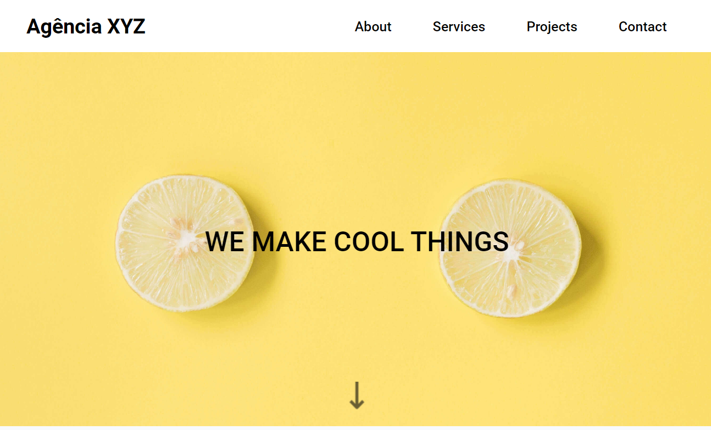
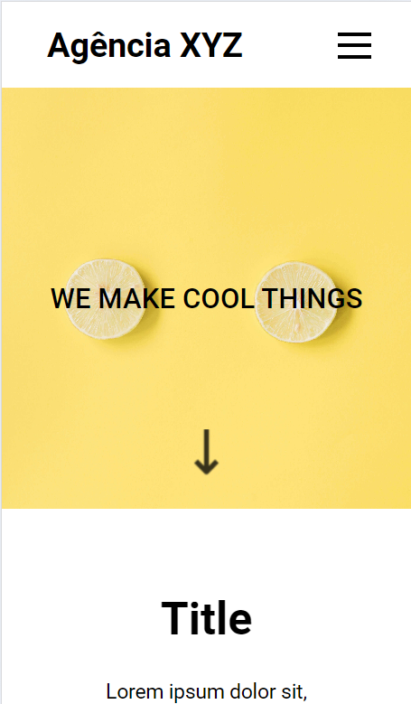

# Agência XYZ


## Visão Geral

O projeto é um site de uma agência fictícia, com seções para apresentar a empresa, os serviços oferecidos, alguns projetos realizados e formas de contato.

Este projeto foi desenvolvido durante uma aula do curso DevQuest, com o objetivo de praticar mais sobre grid e flexbox em conjunto.

## Tecnologias Utilizadas

- HTML
- CSS (com uso de Grid e Flexbox)
- Font Awesome

## Estrutura do Projeto

- `index.html`: Estrutura principal do site.
- `reset.css`: Reset de CSS para padronizar o estilo em diferentes navegadores.
- `variables.css`: Variáveis de CSS para facilitar a manutenção do código.
- `style.css`: Estilos principais do site.
- `menu.css`: Estilos específicos para o menu de navegação.
- `font-awesome.css`: Biblioteca de ícones utilizada no projeto.
- `images/`: Pasta contendo as imagens utilizadas no site.

## Funcionalidades

- **Menu de Navegação:** Um menu de navegação responsivo com um ícone de hambúrguer para dispositivos móveis.
- **Seção Hero:** Uma seção de destaque com um título principal.
- **Sobre:** Informações sobre a agência, incluindo texto e links para saber mais.
- **Serviços:** Descrição dos serviços oferecidos pela agência.
- **Projetos:** Galeria de imagens dos projetos realizados.
- **Contato:** Informações de contato e links para redes sociais.

#


#

## URL do Projeto

[Link do site](https://xyz-agencia.netlify.app)

## Como Rodar o Projeto Localmente

1. Clone o repositório:
   ```bash
   git clone https://github.com/seu-usuario/agencia-xyz.git
   ```

2. Navegue até o diretório do projeto:
   ```bash
   cd agencia-xyz
   ```

3. Abra o arquivo `index.html` no seu navegador preferido.

## Contribuição

Sinta-se à vontade para contribuir com o projeto. Faça um fork do repositório, crie uma branch para sua feature ou correção de bug e abra um pull request.